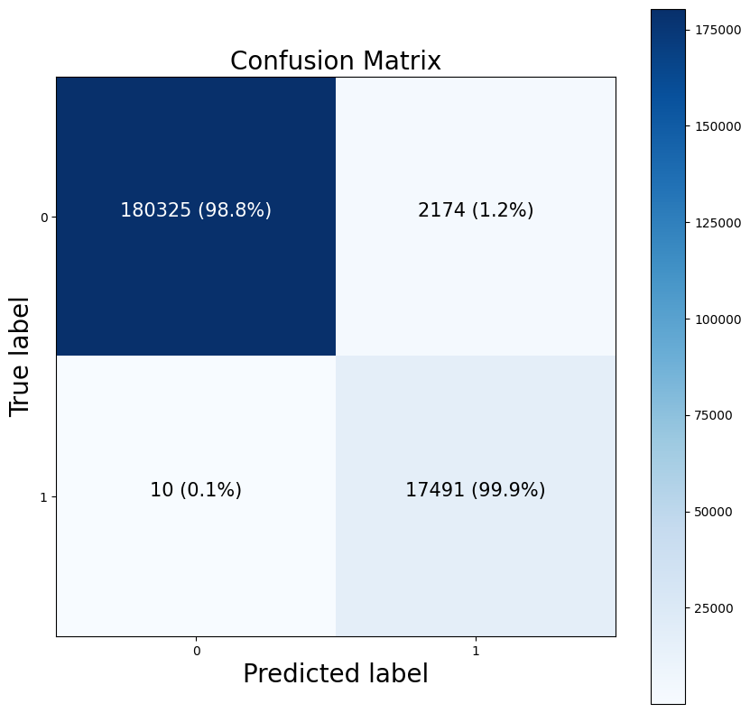

# Credit Card Fraud Detection Using A Deep Neural Network (DNN)

This is a deep learning model designed to monitor credit card transaction history and activity in order to flag fraudulent purchases

## Performance
The model performs with an accuracy of **99.6%** over a test set of 200,000 purchases.

**F1 Score:** 0.51

**Precision:** 0.98

**Recall:** 0.98

```bash
loss: 0.0103 - f1_score: 0.5068 - accuracy: 0.9964 - precision: 0.9757 - recall: 0.9830
```

## Trying the model
Download FraudDetectionModel and add to your local directory. Then load the model using tensorflow

```python
import tensorflow as tf
import pandas as pd

# Load the model
loaded_model = tf.keras.models.load_model("FraudDetectionModel")

# Load your data into a dataframe
dataset = pd.read_csv(file_name.csv)
```
Note that the loaded data must only contain the following entries:
1. Distance from home when transaction happened
2. Distance from last transaction
3. Ratio of transaction purchase amount to median purchase amount
4. Is the transaction from the same retailer?
5. Is the transaction through the chip?
6. Did the transaction use a PIN number?
7. Is the transaction an online order?

```python
# Make your predictions
predictions = tf.squeeze(tf.round(loaded_model.predict(dataset)))

# Create a table to represent your results
table = pd.DataFrame(predictions)
table.replace({0.0: 'Legitimate', 1.0: 'Fraud'}, inplace=True)
table.columns = ['Status']

# View the results
print(table)
```

To isolate fraudulent purchases: 
```python
fraudulent_purchases = []

# Iterates through model predictions and isolates the indices where fraudulent purchases are made
for i in range(len(predictions)):
  if predictions[i] == 1.0:
    fraudulent_purchases.append(i+1)

# The numbers in these array correspond to the purchase number in your purchase history, where 1 is the first purchase from the top, 2 is the second, etc
print(fraudulent_purchases)
```

## Confusion Matrix



## License

[MIT](https://choosealicense.com/licenses/mit/)
